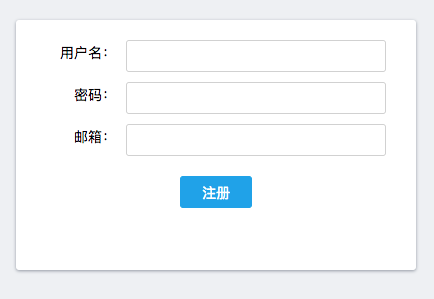

# 使用方式

1. 访问[注册页面](https://mock.clevertools.cn/register)进行注册，注册成功后进行登录

2. 创建项目


代理地址，即你要最终访问的接口服务地址


3. 创建成功后，按照引导，在自己项目中的API请求头中，增加clever-mock请求头信息。然后所有的API请求都请求导[cleverMock服务](https://mock.clevertools.cn)即可完成代理


更多代理设置方式，可访问[https://clevertools.gitbook.io/mock/dai-li-she-zhi-fang-shi](https://clevertools.gitbook.io/mock/dai-li-she-zhi-fang-shi)


4. 添加项目组成员。访问设置页面&gt;&gt;成员管理。即可通过邮箱添加项目组成员，成员默认密码为123456。成员登录后，可在设置页面&gt;&gt;个人设置中修改个人密码及其他个人信息。

